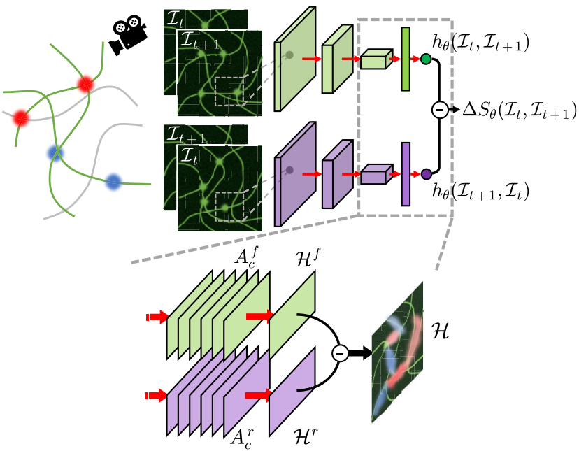

# CNEEP: Convolutional Neural Estimator for Entropy Production

[](https://journals.aps.org/prresearch/abstract/10.1103/PhysRevResearch.4.033094)
[](https://arxiv.org/abs/2106.15108)

Authors: Youngkyoung Bae<sup>1</sup>, Dong-Kyum Kim<sup>1</sup>, and Hawoong Jeong<sup>1,2</sup><br>

<sup>1</sup> <sub>Department of Physics, KAIST</sub>
<sup>2</sup> <sub>Center for Complex Systems, KAIST</sub>

Pytorch implementation of the convolutional neural estimator for entropy production (CNEEP).


## Introduction

This repository is for the code related to the paper [Inferring dissipation maps from videos using convolutional neural networks](https://journals.aps.org/prresearch/abstract/10.1103/PhysRevResearch.4.033094).

## Abstract

For living organisms at mesoscopic scales, attaining dissipation or entropy production (EP) is essential to gain an understanding of their nonequilibrium dynamics. However, when tracking the relevant variables is impractical, it is challenging to figure out where and to what extent dissipation occurs from recorded time-series images from experiments. In this paper, without detailed knowledge of the given systems, we develop an estimator that can quantify the stochastic EP and produce a spatiotemporal pattern of the EP (or dissipation map) from videos through an unsupervised learning algorithm. Applying a convolutional neural network (CNN), our estimator allows us to visualize where the dissipation occurs as well as its time evolution along a video by looking at an attention map of the CNN's last layer. We demonstrate that our estimator accurately measures the stochastic EP and provides a locally heterogeneous dissipation map, which is mainly concentrated in the origins of a nonequilibrium state, from generated Brownian videos of various models. We further confirm high performance even with noisy, low spatial resolution data, and partially observed situations. Our method will provide a practical way to obtain dissipation maps and ultimately contribute to uncovering the source and the dissipation mechanisms of complex nonequilibrium phenomena.

<center></center>

## Installation

### Data

Because Github has a strict limit of file size, we share the data we used for the bead-spring model with $N=2$ through the link https://www.dropbox.com/s/ym0aipl8hf5zip1/data.zip?dl=0.

Please unzip this zip file and put an unzipped folder, named 'data', into the github folder containing the 'toy' and 'notebooks' folder.

### Code

```bash
git clone https://github.com/qodudrud/CNEEP
cd CNEEP
conda create -y --name cneep python=3.6
pip install -r requirement.txt
python -m ipykernel install --name cneep
```

## Jupyter notebook

See the following notebook for a quick run of CNEEP for the bead-spring model with $N=2$.

### Bead-spring model
* [`notebooks/bead-spring.ipynb`](notebooks/bead-spring.ipynb)

